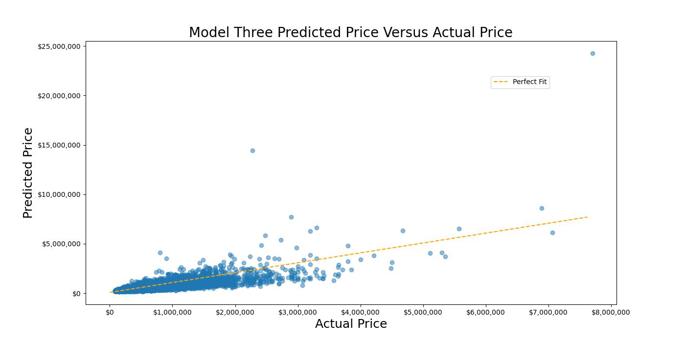
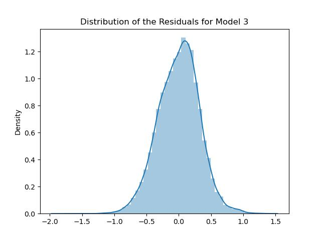
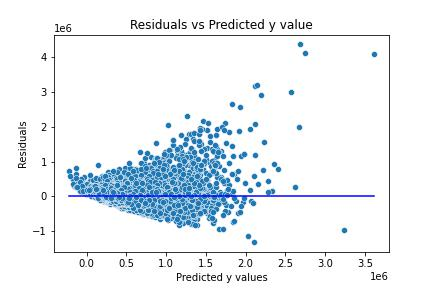
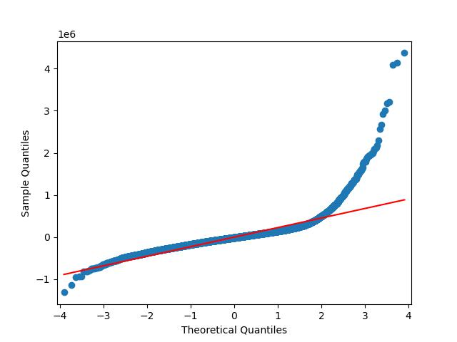

# Henbart LLC House Feature Statistical Analysis

Author Emily Marsh

# Overview

Henbart LLC, a real estate developer in the Seattle area, has purchased undeveloped property outside of the Seattle metropolitan area. The statistical analysis of the Kings County Dataset will show which features maximize profit and will inform the type of homes and properties Henbart LLC will build on this property.

# Business Problem

Henbart LLC, a real estate developer in the Seattle area, has purchased undeveloped property outside of the Seattle metropolitan area. They are responding to the pandemic-era trend where there has been more demand for single-family homes, however with inflation they want to make sure to build houses that will maximize their ROI. 

# Data

The Kings County House Sales Dataset is a dataset that contains the sale price and features of **21597 houses**. Each house has **20 possible features** which include price, bedrooms, bathrooms, square foot of living space, and square foot of lot size. 

# Methods

A linear regression model was developed to help predict house values based on the features they possess. The dependent variable in the linear model was **price of the house** and the independent variables were the **features releveant to the business problem**. Several features were not used in the statistical analysis. The locations where single family homes are to be developed have already been purchased, so the features pertaining to location were not used in this analysis. These included zipcode, lat, long, waterfront, and view. Identifying features were also irrelevant to the analysis (date, id) and to avoid multicollinearity similar columns were dropped leaving only one to summarize the feature. These included sqft_above, sqft_basement, sqft_living15, and sqft_above.

# Results

After exploration of several iterations, the final linear regression model was reached by log transforming the dependent value of price to adjust the data set to adhere to the assumptions of linearity. The R Squared Value, the percentage of variance that is explained by the linear regression model, was **63.5%** with an error of **USD 260,920** when it comes to predicting the price of the house. 

Using histograms, qq-plots, pairplots, and scatterplots were used to interpret the fit of the final model. These data visualizations also served to confirm that the developed model does not violate the assumptions of linearity. 

Using the model, the features with the greatest statistical impact on price of a house were found to be **grade, number of bathrooms, and number of floors**. According to the model developed a unit increase in the grade i.e materials that go into the building of the house will yield an increase of **25.79%** By adding an extra bathroom, the sale price goes up by **9.64%** and by adding an extra floor, the sale price goes up by **8.34%**.

# Conclusion

The model is not very accurate for this dataset. Not only is the error of the model very high, USD 260,920, but the assumptions of linearity are violated in this model. This indicates that another modeling technique may be more appropriate.

Build quality, number of bathrooms, and number of floors in a house are the most statistically significant factors when it comes to increasing the sale price of a house.

# Moving Forward

In order to develop a more statistically accurate model, Henbart LLC could explore the following topics:

1. Exploration of other modeling techniques that may be a better fit for the dataset
2. Further exploration of possible errors in outliers in the dataset
3. Add additional house entries to see if findings still hold true in a bigger dataset

# For More Information

The full analysis and process by which these conclusions were reached can be found in the Jupyter notebook or by reviewing the summary presentation.

For additional questions, contact Emily Marsh: marshemily2@gmail.com

# Repository Structure

 |── Data
 
 ├── Images
 
 ├── README.md
 
 ├── PhaseTwoFinalProjectPresentation.pdf
 
 └── PhaseTwoProject.ipynb

